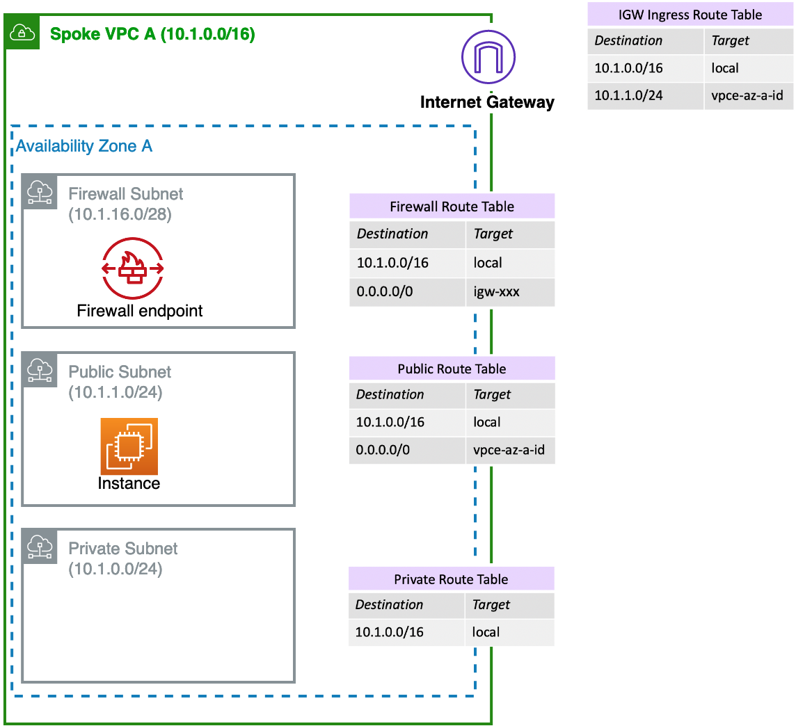

# AWS Network Firewall Templates

## Authors

|Name | Email|
|------|------|
|Shakeel Ahmad, Sr. Solutions Architect |shkahma@amazon.com|
|Daniel Yu, Sr. Technical Account Manager|dyuamzn@amazon.com|

## License:

This sample code is made available under the MIT-0 license. See the LICENSE file.

## Summary:

AWS Network Firewall is a new AWS-managed service that makes it easy to deploy essential network protections for all of your Amazon Virtual Private Clouds (VPCs). The service can be set up with just a few clicks and scales automatically with your network traffic, so you don't have to worry about deploying and managing any infrastructure. AWS Network Firewall is for customers who want to inspect and filter traffic to, from, or between their Amazon VPCs. 

For more information, see the [AWS Network Firewall announcement](https://aws.amazon.com/blogs/aws/aws-network-firewall-new-managed-firewall-service-in-vpc) on the AWS News blog, [product overview page](https://aws.amazon.com/network-firewall/), and the [Deployment models for AWS Network Firewall blog](https://aws.amazon.com/blogs/networking-and-content-delivery/deployment-models-for-aws-network-firewall).

This repository contains sample [AWS CloudFormation](https://aws.amazon.com/cloudformation/) templates to provision AWS Network Firewall for testing & demo purpose.

----

### Distributed Deployment Architecture:

**Template File Name:** [anfw-distributed-template.yaml](https://github.com/aws-samples/aws-networkfirewall-cfn-templates/blob/main/anfw-distributed-template.yaml)

**Deployment Architecture:**

----

### Centralized Deployment Architecture :

**Template File Name:** [anfw-centralized-template.yaml](https://github.com/aws-samples/aws-networkfirewall-cfn-templates/blob/main/anfw-centralized-template.yaml)

**Deployment Architecture:**

