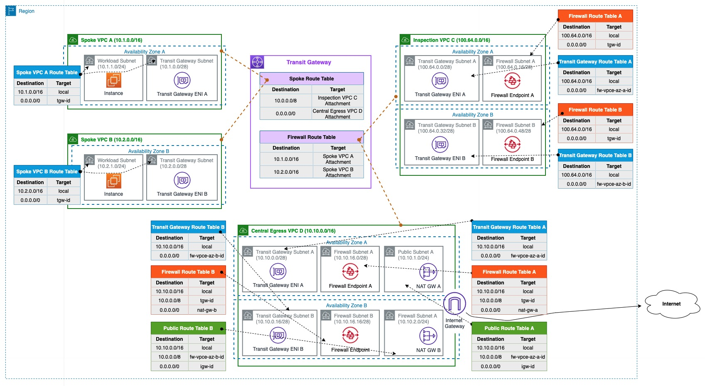

# Centralized Architecture

**Template File:** [anfw-centralized-2az-template.yaml](anfw-centralized-2az-template.yaml)

For centralized deployment model, [AWS Transit Gateway](https://aws.amazon.com/transit-gateway/) is a prerequisite. AWS Transit Gateway acts as a network hub and simplifies the connectivity between VPCs as well as on-premises networks. AWS Transit Gateway also provides inter-region peering capabilities to other Transit Gateways to establish a global network using AWS backbone.

*Figure 1: Multi AZ Centralized Architecture*

[Centralized multi AZ deployment template](anfw-centralized-2az-template.yaml), as described in Figure 1, creates dedicated

* Inspection VPC for East-West (inter-vpc) traffic inspection. Inspection VPC consists of two subnets in each AZs:
  * Transit Gateway subnet for Transit Gateway attchment.
  * Firewall subnet for firewall endpoint.

* Central Egress VPC for North-South (spoke VPCs to Internet) traffic inspection. Central Egress VPC consists of 3 subnets in each AZs: 
  * Transit Gateway subnet for Transit Gateway attchment.
  * Firewall subnet for firewall endpoint.
  * Public subnet for NAT Gateway.

* Two spoke VPCs. Spoke VPCs resources are configured only single AZ.

Each Transit Gateway subnet in each dedicated VPC requires a dedicated VPC route table to ensure the traffic is forwarded to firewall endpoint within the same AZ. These route tables have a default route (0.0.0.0/0) pointing towards firewall endpoint in the same AZ.

This is a Multi AZ configuration. Resources in Inpsection VPC and Centrall Egress VPC are provisioned across two AZs. You can also refer to [Single AZ Deployment](single_az_deployment) for testing/poc purpose only.

For more details, refer to [Blog: Deployment models for AWS Network Firewall](https://aws.amazon.com/blogs/networking-and-content-delivery/deployment-models-for-aws-network-firewall/)