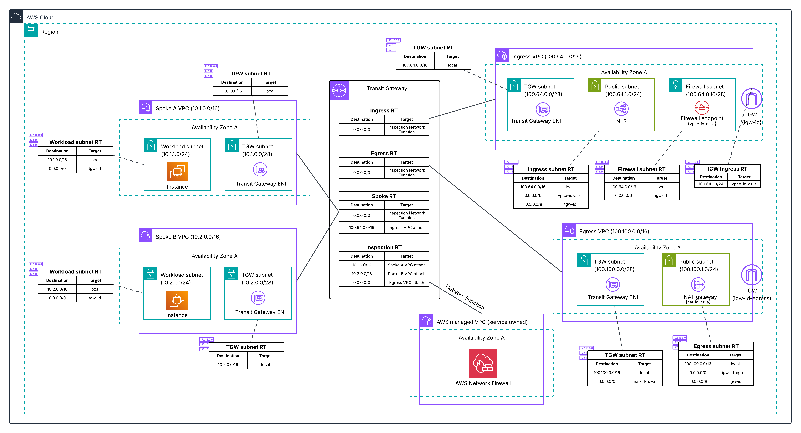

# Centralized Ingress + Egress/East-West Inspection - Single AZ

**Template File:** [anfw-centralized-ingress-and-egress-1az-template.yaml](anfw-centralized-ingress-and-egress-1az-template.yaml)

This template deploys a dual-firewall architecture for centralized network inspection: a VPC-attached ingress firewall for inbound non-web traffic (SSH/SFTP), and a TGW-native egress/east-west firewall that inspects all outbound and spoke-to-spoke traffic with visibility into true source IPs. Designed for testing, development, and proof-of-concept environments.

## Why Network Firewall for Ingress?

AWS WAF is the recommended solution for ingress filtering of HTTP/HTTPS traffic to supported resources (ALBs, CloudFront, API Gateway). Network Firewall is the best fit for centralized ingress inspection of **non-web protocols** and resources that WAF does not support, such as:
- SSH/SFTP servers behind NLBs
- Custom TCP/UDP protocols (IoT, gaming, SIP/VoIP, streaming media)
- DNS resolvers
- Any non-HTTP service exposed to the internet



## Architecture Overview

### Components
- **Ingress VPC** (100.64.0.0/16) - IGW, VPC-attached Network Firewall, internet-facing NLB
- **Egress VPC** (10.100.0.0/16) - NAT Gateway, IGW for outbound internet
- **Egress/East-West Firewall** - TGW-native attached, inspects egress and spoke-to-spoke traffic
- **Spoke A** (10.1.0.0/16) - SSH bastion (10.1.1.10)
- **Spoke B** (10.2.0.0/16) - SFTP server (10.2.1.10)
- **Transit Gateway** - Connects all VPCs with four route tables

### Traffic Flows

**Ingress (SSH on port 22 → Spoke A):**
Internet → IGW → Ingress NFW → NLB (port 22) → TGW → Spoke A EC2

**Ingress (SFTP on port 2222 → Spoke B):**
Internet → IGW → Ingress NFW → NLB (port 2222) → TGW → Spoke B EC2

**Egress (sees true source IP):**
EC2 → TGW → Egress/EW NFW (sees 10.x.x.x) → TGW → Egress VPC → NAT GW → IGW → Internet

**East-West (spoke-to-spoke, inspected):**
Spoke A → TGW → Egress/EW NFW → TGW → Spoke B

## Parameters

| Parameter | Description | Required |
|-----------|-------------|----------|
| AvailabilityZoneSelection | Availability Zone for all resources | Yes (default: us-east-1a) |
| AllowedSourceIP | Your public IP in CIDR /32 format (e.g., 203.0.113.25/32) | Yes |
| LatestAmiId | SSM parameter for Amazon Linux 2023 AMI | No (auto-resolved) |

## Deployment

```bash
# Get your public IP
MY_IP=$(curl -s https://checkip.amazonaws.com)

# Deploy
aws cloudformation deploy \
  --stack-name anfw-centralized-ingress-1az \
  --template-file anfw-centralized-ingress-and-egress-1az-template.yaml \
  --parameter-overrides \
    AvailabilityZoneSelection=us-east-1a \
    AllowedSourceIP="${MY_IP}/32" \
  --capabilities CAPABILITY_NAMED_IAM
```

## Testing

After deployment (~10 minutes for NLB health checks to converge):

```bash
# Get the NLB DNS and password
NLB=$(aws cloudformation describe-stacks --stack-name anfw-centralized-ingress-1az \
  --query "Stacks[0].Outputs[?OutputKey=='IngressNLBDNSName'].OutputValue" --output text)
PASS=$(aws secretsmanager get-secret-value \
  --secret-id /anfw-centralized-ingress-1az/demo-user-password \
  --query SecretString --output text)

# Test SSH (port 22 → Spoke A)
ssh demouser@$NLB    # password: $PASS

# Test SFTP (port 2222 → Spoke B)
sftp -P 2222 sftpuser@$NLB    # password: $PASS

# Verify egress path (from inside SSH session)
curl https://checkip.amazonaws.com    # Should show Egress NAT GW EIP
```

## Key Design Decisions

1. **Dual firewalls** - Ingress (VPC-attached) uses IGW routing trick for inbound inspection. Egress (TGW-native) sees true source IPs before NAT.
2. **Non-web protocols** - SSH/SFTP sample workloads to demonstrate NFW's value for traffic WAF cannot inspect.
3. **Static EC2 IPs** - No spoke NLBs needed; central NLB targets EC2 IPs directly via TGW.
4. **IP-restricted access** - NLB security group locked to deployer's IP (AllowedSourceIP parameter).
5. **Password auth via Secrets Manager** - Random 24-char password, no key pair required.
6. **East-west inspection** - All spoke-to-spoke traffic routed through the egress firewall.

## TGW Route Tables

| Route Table | Associated With | Routes |
|-------------|----------------|--------|
| Spoke RT | Spoke A & B attachments | 0.0.0.0/0 → Egress FW, 100.64.0.0/16 → Ingress VPC |
| Ingress VPC RT | Ingress VPC attachment | 10.1.0.0/16, 10.2.0.0/16 (propagated from spokes) |
| Egress Inspection RT | Egress FW attachment | 0.0.0.0/0 → Egress VPC, spoke routes (propagated) |
| Egress VPC RT | Egress VPC attachment | 0.0.0.0/0 → Egress FW (symmetric return) |

## Firewall Rules

Both firewalls deploy with **log-only rules** by default (no blocking). This allows you to observe traffic patterns before enabling enforcement.

**Ingress firewall alerts on:** HTTP, TLS, SSH, ICMP, and generic IP inbound traffic.

**Egress/east-west firewall alerts on:** Geo-destined traffic (RU, CN), high-risk TLDs (.ru, .xyz, .info, .onion), and protocol-specific alerts (HTTP, TLS, SSH, ICMP).

## Production Considerations

- **Single AZ** - No high availability. Use the [Two AZ Deployment](../two_az/) for production.
- **Log-only rules** - Enable enforcement rule groups when ready to block traffic.
- **Scaling** - Add more spoke VPCs by creating TGW attachments and associating with the Spoke RT.

## Additional Resources

- [AWS Network Firewall Documentation](https://docs.aws.amazon.com/network-firewall/)
- [AWS Network Firewall Best Practices](https://aws.github.io/aws-security-services-best-practices/guides/network-firewall/)
- [Deployment models for AWS Network Firewall](https://aws.amazon.com/blogs/networking-and-content-delivery/deployment-models-for-aws-network-firewall/)
