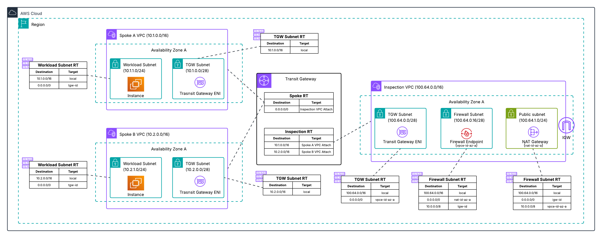

# Centralized Architecture - Single AZ Deployment

**Template File:** [anfw-centralized-1az-template.yaml](anfw-centralized-1az-template.yaml)

This template deploys AWS Network Firewall in a centralized architecture pattern within a single Availability Zone. This configuration is designed for testing, development, and proof-of-concept environments.



## Architecture Overview

This single AZ deployment creates a centralized inspection model using AWS Transit Gateway as the network hub. All traffic between spoke VPCs and to the Internet is routed through dedicated inspection points.

## Resources Created

### Inspection VPC
Centralized VPC for both East-West (VPC to VPC) and North-South (Internet-bound) traffic inspection:
- **Transit Gateway Subnet** - Attachment point for Transit Gateway
- **Firewall Subnet** - Contains AWS Network Firewall endpoint
- **Public Subnet** - Contains NAT Gateway for Internet access

### Spoke VPCs
Two example workload VPCs that demonstrate traffic routing through the inspection points:
- Private subnets for workload resources
- Route tables configured to send traffic through Transit Gateway

### AWS Network Firewall
- Firewall policy with example rules
- Firewall endpoint in the Inspection VPC
- Logging configuration for traffic analysis

### Transit Gateway
- Central routing hub connecting all VPCs
- Route tables configured to direct traffic through inspection VPC
- Appliance Mode enabled for the inspection VPC attachment to ensure flow symmetry

## Traffic Flow

1. **East-West Traffic** - VPC to VPC communication routes through the Inspection VPC firewall endpoint
2. **Egress Traffic** - Internet-bound traffic routes through the Inspection VPC firewall endpoint and NAT Gateway

## Deployment Instructions

1. Ensure you have appropriate AWS permissions
2. Deploy the CloudFormation template:
   ```bash
   aws cloudformation create-stack \
     --stack-name anfw-centralized-1az \
     --template-body file://anfw-centralized-1az-template.yaml \
     --capabilities CAPABILITY_IAM
   ```

## Important Notes

- **Cost Optimization** - Single VPC design eliminates multiple Transit Gateway traversals - for egress traffic to the internet
- **Single AZ Limitation** - This deployment lacks high availability and should not be used in production. Designed for development, testing, and learning environments

## Production Considerations

For environments requiring high availability, consider the [Two AZ Deployment](../two_az_deployment/) which provides:
- High availability across multiple Availability Zones
- Better fault tolerance
- Resilient architecture

## Additional Resources

- [AWS Network Firewall Documentation](https://docs.aws.amazon.com/network-firewall/)
- [AWS Transit Gateway Documentation](https://docs.aws.amazon.com/transit-gateway/)
- [Deployment models for AWS Network Firewall Blog](https://aws.amazon.com/blogs/networking-and-content-delivery/deployment-models-for-aws-network-firewall/)
