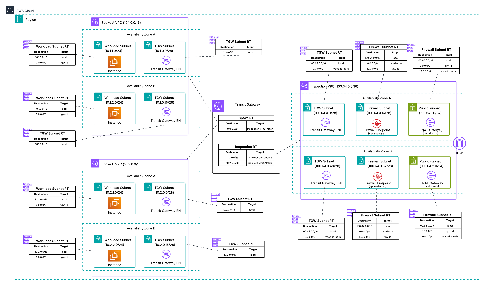

# Centralized Architecture - Two AZ Deployment

**Template File:** [anfw-centralized-2az-template.yaml](anfw-centralized-2az-template.yaml)

This template deploys AWS Network Firewall in a centralized architecture pattern across two Availability Zones. This configuration provides high availability and is recommended for production environments.



## Architecture Overview

This multi-AZ deployment creates a centralized inspection model using AWS Transit Gateway as the network hub. All traffic between spoke VPCs and to the Internet is routed through dedicated inspection points distributed across two Availability Zones for high availability.

## Resources Created

### Inspection VPC
Centralized VPC for both East-West (VPC to VPC) and North-South (Internet-bound) traffic inspection across two AZs:
- **Transit Gateway Subnets** - Attachment points for Transit Gateway in each AZ
- **Firewall Subnets** - Contains AWS Network Firewall endpoints in each AZ
- **Public Subnets** - Contains NAT Gateways for Internet access in each AZ

### Spoke VPCs
Two example workload VPCs that demonstrate traffic routing through the inspection points:
- Private subnets distributed across availability zones
- Route tables configured to send traffic through Transit Gateway

### AWS Network Firewall
- Firewall policy with example rules
- Firewall endpoints in the Inspection VPC across both AZs
- Logging configuration for traffic analysis
- High availability through multi-AZ deployment

### Transit Gateway
- Central routing hub connecting all VPCs
- Route tables configured to direct traffic through inspection VPC
- Appliance Mode enabled for the inspection VPC attachment to ensure flow symmetry


## Traffic Flow

1. **East-West Traffic** - VPC to VPC communication routes through the Inspection VPC firewall endpoints
2. **Egress Traffic** - Internet-bound traffic routes through the Inspection VPC firewall endpoints and NAT Gateways

## High Availability Features

- **Multi-AZ Deployment** - Resources distributed across two Availability Zones
- **AZ-Specific Routing** - Dedicated route tables ensure traffic stays within the same AZ


## Deployment Instructions

1. Ensure you have appropriate AWS permissions
2. Deploy the CloudFormation template:
   ```bash
   aws cloudformation create-stack \
     --stack-name anfw-centralized-2az \
     --template-body file://anfw-centralized-2az-template.yaml \
     --capabilities CAPABILITY_IAM
   ```

## Multi-AZ Benefits

- **High Availability** - Continues operating if one AZ becomes unavailable
- **Fault Tolerance** - No single point of failure
- **Performance** - AZ-aware routing minimizes latency
- **Scalability** - Can handle higher traffic volumes across multiple AZs

## Cost Considerations

This deployment incurs higher costs compared to single AZ due to:
- Additional NAT Gateway in second AZ
- Additional firewall endpoints

## Testing Alternative

For development and testing environments, consider the [Single AZ Deployment](../single_az_deployment/) which provides the same functionality at lower cost.

## Additional Resources

- [AWS Network Firewall Documentation](https://docs.aws.amazon.com/network-firewall/)
- [AWS Transit Gateway Documentation](https://docs.aws.amazon.com/transit-gateway/)
- [Deployment models for AWS Network Firewall Blog](https://aws.amazon.com/blogs/networking-and-content-delivery/deployment-models-for-aws-network-firewall/)
