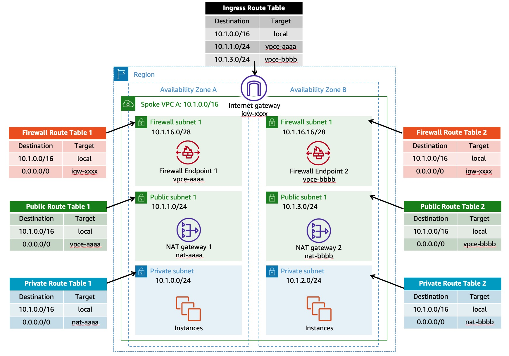

# Distributed Architecture

**Template File:** [anfw-distributed-2az-template.yaml](anfw-distributed-2az-template.yaml)

For the distributed deployment model, we deploy AWS Network Firewall into each VPC which requires protection. Each VPC is protected individually and blast radius is reduced through VPC isolation. Each VPC does not require connectivity to any other VPC or AWS Transit Gateway. Each AWS Network Firewall can have its own firewall policy or share a policy through common rule groups (reusable collections of rules) across multiple firewalls. This allows each AWS Network Firewall to be managed independently, which reduces the possibility of misconfiguration and limits the scope of impact.

*Figure 1: Multi AZ Distributed Architecture*

[Distributed multi AZ deployment template](anfw-distributed-2az-template.yaml), as described in Figure 1, creates:

* Spoke VPC. Spoke VPC consists of three subnets in each AZ:
  * Private subnet for application/client.
  * Public subnet for NAT Gateway.
  * Firewall subnet for firewall endpoint.

For return traffic, Ingress Route Table is associated with Internet Gateway to ensure the traffic is forwarded to firewall endpoint within the same AZ. This route tables has public subnet route pointing towards firewall endpoint in the same AZ.

This is a Multi AZ configuration. You can also refer to [Single AZ Deployment](single_az_deployment) for testing/poc purpose only.

For more details, refer to [Blog: Deployment models for AWS Network Firewall](https://aws.amazon.com/blogs/networking-and-content-delivery/deployment-models-for-aws-network-firewall/).
