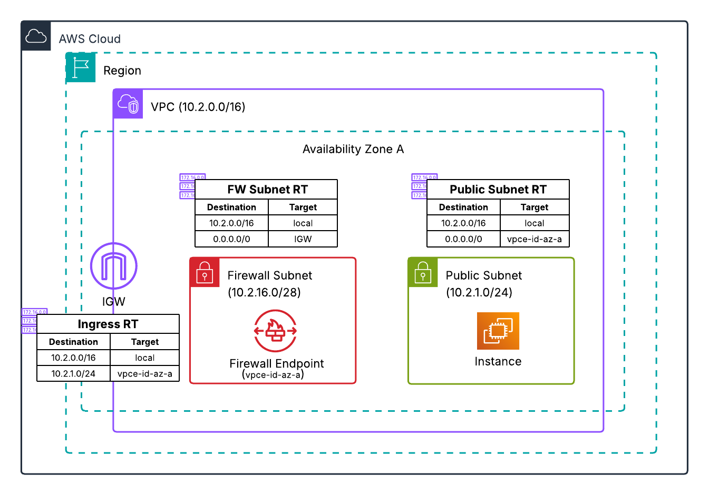

# Distributed Architecture - Single AZ Combined Firewall

**Template File:** [anfw-distributed-1az-single-firewall-template.yaml](anfw-distributed-1az-single-firewall-template.yaml)

This template deploys AWS Network Firewall in a distributed architecture with a single firewall handling both ingress and egress traffic within one Availability Zone. This configuration is designed for testing and development environments.



## Architecture Overview

This template creates a VPC with AWS Network Firewall deployed directly within it, providing protection for both inbound and outbound traffic through a single firewall endpoint.

**Important:** This model is designed for applications with resources that have public IP addresses. It does not support public load balancer applications with workloads in private subnets due to the lack of NAT Gateway and single endpoint architecture. For public load balancer applications with private subnet workloads, use the [Separate Ingress and Egress Firewall](../separate-ingress-and-egress-firewall/) model.

## Resources Created

### VPC Subnets
- **Public Subnet** - Contains test instance with public IP address
- **Firewall Subnet** - Contains AWS Network Firewall endpoint

### AWS Network Firewall
- Single firewall endpoint handling all traffic
- Firewall policy with example rules for both ingress and egress
- Logging configuration for traffic analysis

### Networking Components
- **Internet Gateway** - Provides Internet connectivity
- **Route Tables** - Direct traffic through firewall endpoint
- **Ingress Route Table** - Associated with Internet Gateway for routing inbound traffic though firewall endpoint

**Note:** This template does not include a NAT Gateway. All traffic flows through Network Firewall endpoint.

## Traffic Flow

1. **Outbound Traffic** - Test instance in public subnet → Firewall endpoint → Internet Gateway
2. **Inbound Traffic** - Internet → Internet Gateway → Firewall endpoint → Public subnet
3. **Inspection** - All traffic (ingress and egress) inspected by Network Firewall

## Route Table Configuration

- **Public Subnet Route Table** - Default route points to firewall endpoint
- **Firewall Subnet Route Table** - Default route to Internet Gateway
- **Ingress Route Table** - Associated with IGW, routes public subnet traffic to firewall endpoint

## Deployment Instructions

1. Ensure you have appropriate AWS permissions
2. Deploy the CloudFormation template:
   ```bash
   aws cloudformation create-stack \
     --stack-name anfw-distributed-1az-single \
     --template-body file://anfw-distributed-1az-single-firewall-template.yaml \
     --capabilities CAPABILITY_IAM
   ```

## Use Cases

- **Applications with Public IPs** - Resources that require direct internet connectivity
- **Development Testing** - Test firewall policies and rules
- **Proof of Concept** - Demonstrate distributed firewall architecture
- **Cost-Optimized Testing** - Single AZ reduces costs for testing

## Limitations

- **Single AZ** - No high availability or fault tolerance
- **Public IP Required** - Resources must have public IP addresses
- **No NAT Gateway** - Cannot support private subnet workloads with public load balancers
- **Testing Only** - Not suitable for production workloads

## High Availability Considerations

For environments requiring high availability, consider:
- [Two AZ Combined Firewall](../../two_az_deployment/combined-ingress-and-egress-firewall/) for high availability
- [Separate Firewalls](../separate-ingress-and-egress-firewall/) for traffic separation

## Additional Resources

- [AWS Network Firewall Documentation](https://docs.aws.amazon.com/network-firewall/)
- [VPC Route Tables Documentation](https://docs.aws.amazon.com/vpc/latest/userguide/VPC_Route_Tables.html)
- [Deployment models for AWS Network Firewall Blog](https://aws.amazon.com/blogs/networking-and-content-delivery/deployment-models-for-aws-network-firewall/)
