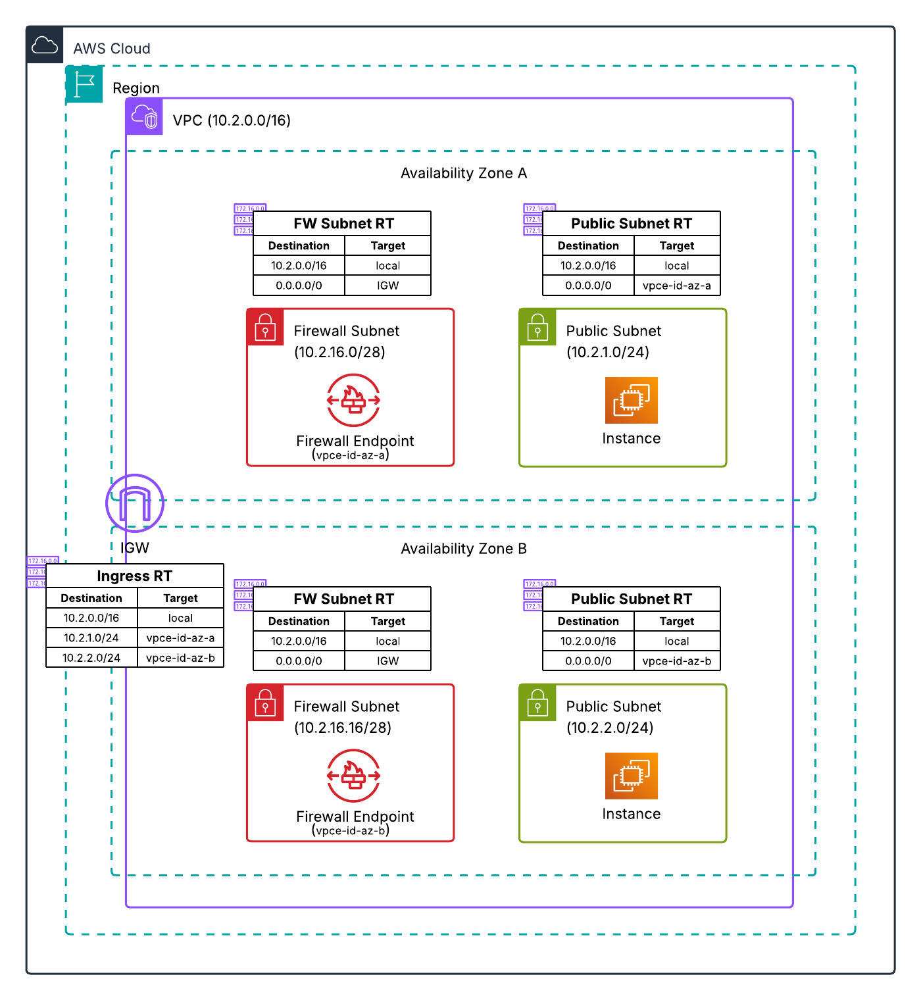

# Distributed Architecture - Two AZ Combined Firewall

**Template File:** [anfw-distributed-2az-single-firewall-template.yaml](anfw-distributed-2az-single-firewall-template.yaml)

This template deploys AWS Network Firewall in a distributed architecture with a single firewall handling both ingress and egress traffic across two Availability Zones. This configuration provides high availability and is suitable for environments requiring fault tolerance.



## Architecture Overview

This template creates a VPC with AWS Network Firewall deployed across two Availability Zones, providing protection for both inbound and outbound traffic through firewall endpoints in each AZ.

**Important:** This model is designed for applications with resources that have public IP addresses. It does not support public load balancer applications with workloads in private subnets due to the lack of NAT Gateway and single endpoint per AZ architecture. For public load balancer applications with private subnet workloads, use the [Separate Ingress and Egress Firewall](../separate-ingress-and-egress-firewall/) model.

## Resources Created

### VPC Subnets (across 2 AZs)
- **Public Subnets** - Contains test instances with public IP addresses in each AZ
- **Firewall Subnets** - Contains AWS Network Firewall endpoints in each AZ

### AWS Network Firewall
- Firewall endpoints in both Availability Zones
- Single firewall policy handling both ingress and egress traffic
- Logging configuration for traffic analysis
- High availability through multi-AZ deployment

### Networking Components
- **Internet Gateway** - Provides Internet connectivity
- **Route Tables** - AZ-specific routing through firewall endpoints
- **Ingress Route Tables** - Associated with Internet Gateway for inbound traffic inspection

**Note:** This template does not include NAT Gateways. All traffic flows through Network Firewall endpoints.

## Traffic Flow

1. **Outbound Traffic** - Test instances in public subnets → Firewall endpoints → Internet Gateway
2. **Inbound Traffic** - Internet → Internet Gateway → Firewall endpoints → Public subnets
3. **AZ Affinity** - Traffic processed within the same AZ

## High Availability Features

- **Multi-AZ Deployment** - Firewall endpoints in both AZs
- **AZ-Specific Routing** - Traffic stays within the same AZ

## Route Table Configuration

Each AZ has dedicated route tables to ensure traffic affinity:
- **Public Subnet Route Tables** - Default route points to firewall endpoint in same AZ
- **Firewall Subnet Route Tables** - Default route to Internet Gateway in same AZ
- **Ingress Route Tables** - Associated with IGW, routes traffic to appropriate AZ firewall endpoint

## Deployment Instructions

1. Ensure you have appropriate AWS permissions
2. Deploy the CloudFormation template:
   ```bash
   aws cloudformation create-stack \
     --stack-name anfw-distributed-2az-single \
     --template-body file://anfw-distributed-2az-single-firewall-template.yaml \
     --capabilities CAPABILITY_IAM
   ```

## Multi-AZ Benefits

- **High Availability** - Continues operating if one AZ fails
- **Fault Tolerance** - No single point of failure
- **Performance** - AZ-aware routing minimizes latency
- **Simplified Management** - Single firewall policy for all traffic

## Use Cases

- **Applications with Public IPs** - Resources that require direct internet connectivity
- **High Availability Requirements** - When uptime is critical
- **Simplified Operations** - Single policy for all traffic types
- **Fault Tolerant Architectures** - Environments requiring resilience

## Architecture Limitations

- **Public IP Required** - Resources must have public IP addresses
- **No NAT Gateway** - Cannot support private subnet workloads with public load balancers

## Alternative Configurations

- **Private Subnet Workloads**: Use [Separate Firewalls](../separate-ingress-and-egress-firewall/) for public load balancer applications with private resources
- **Cost Optimization**: Consider [Single AZ](../../single_az_deployment/combined-ingress-and-egress-firewall/) for testing

## Additional Resources

- [AWS Network Firewall Documentation](https://docs.aws.amazon.com/network-firewall/)
- [VPC Route Tables Documentation](https://docs.aws.amazon.com/vpc/latest/userguide/VPC_Route_Tables.html)
- [Deployment models for AWS Network Firewall Blog](https://aws.amazon.com/blogs/networking-and-content-delivery/deployment-models-for-aws-network-firewall/)
