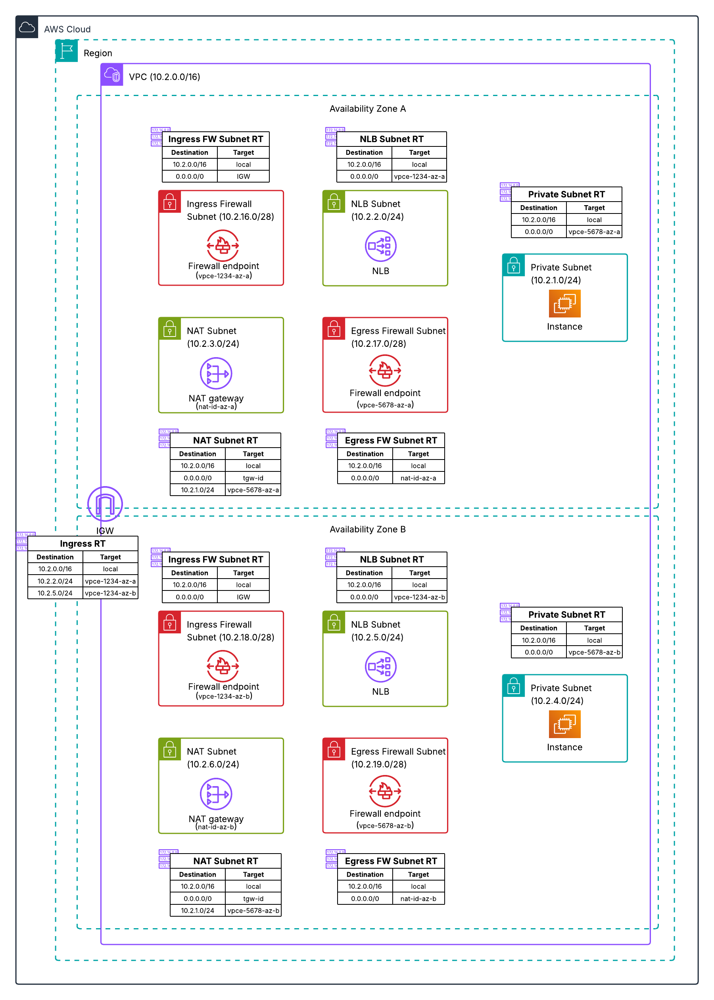

# Distributed Architecture - Two AZ Separate Firewalls

**Template File:** [anfw-distibuted-2az-dual-firewall-template.yaml](anfw-distibuted-2az-dual-firewall-template.yaml)

This template deploys AWS Network Firewall in a distributed architecture with separate firewalls for ingress and egress traffic across two Availability Zones. This configuration provides the highest level of security through traffic separation and high availability.



## Architecture Overview

This template creates a VPC with two AWS Network Firewall deployments - one dedicated to inbound traffic and another for outbound traffic. This separation provides enhanced security, granular policy control, and ensures source IP visibility to the firewalls for both ingress and egress traffic.

## Resources Created

### VPC with Subnets (across 2 AZs)
- **Private Subnets** - Contains application resources without public IP addresses in each AZ
- **NAT Subnets (Public)** - Contains NAT Gateways for outbound Internet access in each AZ
- **NLB Subnet (Public)** - Contains Network Load Balancer nodes in each AZ
- **Ingress Firewall Subnets** - Contains firewall endpoints for inbound traffic in each AZ
- **Egress Firewall Subnets** - Contains firewall endpoints for outbound traffic in each AZ

### AWS Network Firewall
- **Ingress Firewalls** - Dedicated endpoints for inbound Internet traffic in both AZs
- **Egress Firewalls** - Dedicated endpoints for outbound Internet traffic in both AZs
- Separate firewall policies for ingress and egress traffic
- Independent logging configuration for each firewall type
- High availability through multi-AZ deployment

### Networking Components
- **Internet Gateway** - Provides Internet connectivity
- **NAT Gateways** - One in each AZ for outbound Internet access
- **Network Load Balancer** - Provides public IP for ingress connections to private resources
- **Route Tables** - AZ-specific routing through appropriate firewall endpoints
- **Ingress Route Tables** - Associated with Internet Gateway for return traffic

## Traffic Flow

1. **Inbound Traffic** - Internet traffic routes through ingress firewall endpoint to Network Load Balancer (NLB), then to private resources in same AZ
2. **Outbound Traffic** - Private resources route through egress firewall endpoint to NAT Gateway in same AZ
3. **Traffic Separation** - Ingress and egress traffic processed by dedicated firewalls
4. **AZ Affinity** - Traffic processed within the same AZ to minimize latency
5. **Private Resources** - Resources remain private, using NLB for ingress and NAT Gateway for egress

## High Availability Features

- **Multi-AZ Deployment** - All firewall types deployed across both AZs
- **Redundant Firewalls** - Ingress and egress firewalls in each AZ
- **Redundant NAT Gateways** - One in each AZ for Internet access
- **AZ-Specific Routing** - Traffic stays within the same AZ when possible
- **Automatic Failover** - AWS Network Firewall handles AZ failures

## Security Benefits

- **Source IP Visibility** - Separate endpoints ensure source IP is visible to firewalls in both directions
- **Traffic Separation** - Complete isolation of ingress and egress traffic
- **Granular Policies** - Independent rules for inbound vs outbound traffic
- **Enhanced Monitoring** - Separate logging for each traffic type and AZ
- **Reduced Attack Surface** - Compromised policy affects only one traffic direction
- **Compliance Ready** - Meets strict security requirements for traffic isolation

## Deployment Instructions

1. Ensure you have appropriate AWS permissions
2. Deploy the CloudFormation template:
   ```bash
   aws cloudformation create-stack \
     --stack-name anfw-distributed-2az-dual \
     --template-body file://anfw-distibuted-2az-dual-firewall-template.yaml \
     --capabilities CAPABILITY_IAM
   ```

## Multi-AZ Benefits

- **High Availability** - Continues operating if one AZ fails
- **Fault Tolerance** - Multiple layers of redundancy
- **Granular Control** - Independent policies for each traffic type
- **Compliance** - Meets strict regulatory requirements

## Use Cases

- **Critical Workloads** - Mission-critical applications
- **Advanced Policy Management** - When different teams manage ingress/egress policies

## Alternative Configurations

- **Cost Optimization**: Consider [Combined Firewall](../combined-ingress-and-egress-firewall/) for simplified management
- **Testing**: Consider [Single AZ Separate Firewalls](../../single_az_deployment/separate-ingress-and-egress-firewall/) for development

## Additional Resources

- [AWS Network Firewall Documentation](https://docs.aws.amazon.com/network-firewall/)
- [VPC Route Tables Documentation](https://docs.aws.amazon.com/vpc/latest/userguide/VPC_Route_Tables.html)
- [Deployment models for AWS Network Firewall Blog](https://aws.amazon.com/blogs/networking-and-content-delivery/deployment-models-for-aws-network-firewall/)
