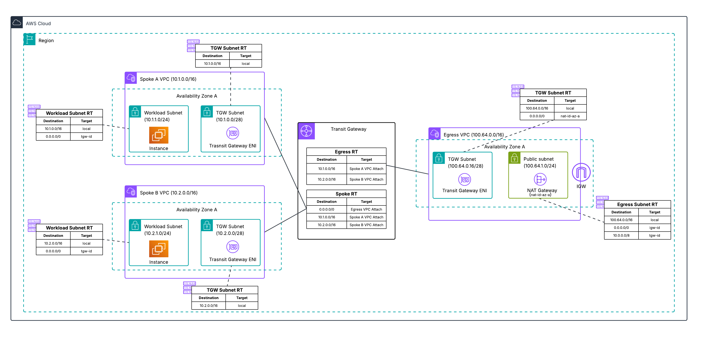

# Transit Gateway-Attached Firewall

The AWS Network Firewall integration with AWS Transit Gateway enables you to create and centrally manage firewall protective coverage without provisioning multiple firewall endpoints. This native attachment capability allows firewall owners to attach a Network Firewall directly to a transit gateway as a transit gateway attachment, either within their own account or shared from a different account.

## Key Benefits

- **Simplified Architecture** - Direct attachment to Transit Gateway eliminates the need for a dedicated inspection VPC and the need to set up subnet routing
- **Centralized Management** - Single firewall attachment provides inspection for East-West and egress traffic
- **Automatic Appliance Mode** - Always enabled for transit gateway-attached firewalls
- **Cost Optimization** - Centralized design reduces infrastructure overhead by eliminating firewall endpoint sprawl

## Available Deployment Options

This folder contains two deployment approaches:

### [Manual Deployment](manual-deployment-tgw-attached-firewall/)
- **Use Case:** Learning and hands-on configuration experience
- **Approach:** Deploy base infrastructure via CloudFormation, then manually configure the firewall attachment and routing through the AWS Console

### [Pre-Deployed](pre-deployed-tgw-attached-firewall/)
- **Use Case:** Production deployments and automated provisioning
- **Approach:** Complete CloudFormation template with firewall attachment and routing pre-configured

## Important Considerations

Before deploying a transit gateway-attached firewall, be aware of the following:

- **Multi-Service Integration** - Involves AWS Network Firewall, AWS Transit Gateway, and AWS RAM
- **Cross-Account Permissions** - Transit Gateway must be shared via AWS RAM if firewall and TGW are in different accounts
- **Availability Zone Alignment** - Firewall must be configured in the same AZ where the transit gateway is enabled
- **Routing Requirements** - Traffic must be routed through Transit Gateway route tables, not VPC route tables
- **Stateful Rule Configuration** - When using HOME_NET or EXTERNAL_NET in stateful rules, configure values different from defaults in the firewall policy
- **Appliance Mode** - Always enabled on transit gateway-attached firewalls

## Additional Resources

For detailed information about transit gateway-attached firewalls, refer to:
- [AWS Network Firewall Documentation: Create a transit gateway-attached firewall](https://docs.aws.amazon.com/network-firewall/latest/developerguide/tgw-firewall.html)
- [AWS Blog: Deployment models for AWS Network Firewall](https://aws.amazon.com/blogs/networking-and-content-delivery/deployment-models-for-aws-network-firewall/)

