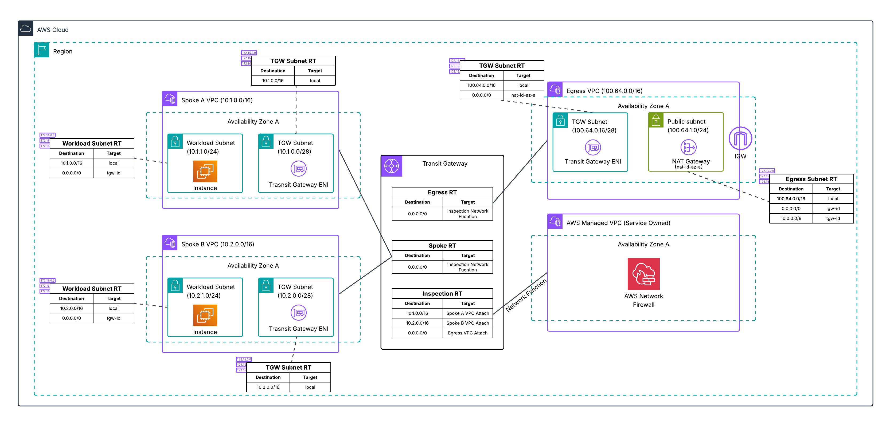

# Pre-Deployed Transit Gateway-Attached Firewall

**Template File:** [tgw-native-attach-firewall.yaml](tgw-native-attach-firewall.yaml)

This template provides a fully automated deployment of AWS Network Firewall with native Transit Gateway attachment. The complete infrastructure is deployed with firewall attachment and routing pre-configured for immediate use.



## Architecture Overview

This deployment demonstrates the Transit Gateway native attachment capability, where AWS Network Firewall attaches directly to Transit Gateway as a network function. This eliminates the need for manual setup of a dedicated inspection VPC, Network Firewall deployment within it, and complex subnet routing, while providing centralized inspection.

## Resources Created

### Transit Gateway
Central routing hub connecting all VPCs with three route tables:
- **Spoke Route Table** - Associated with spoke VPC attachments, routes all traffic to firewall attachment
- **Inspection Route Table** - Associated with firewall attachment, routes to egress VPC or spoke VPCs
- **Egress Route Table** - Associated with egress VPC attachment, routes all traffic to firewall attachment

### AWS Network Firewall
Network Firewall with Transit Gateway native attachment:
- Firewall with Transit Gateway attachment (network function)
- Stateful rule groups with egress allow-list and logging rules
- CloudWatch logging for flow and alert logs

### Spoke VPCs (Spoke A and Spoke B)
Two example workload VPCs demonstrating traffic patterns:
- Workload subnets with EC2 instances
- Transit Gateway attachment subnets
- VPC endpoints for SSM access
- Route tables directing traffic to Transit Gateway

### Egress VPC
Centralized VPC providing internet access:
- **Public Subnet** - Contains NAT Gateway
- **Transit Gateway Subnet** - Attachment point for Transit Gateway

## Traffic Flow

**East-West Traffic (Spoke to Spoke)**
1. Traffic originates from Spoke VPC workload
2. VPC route table sends traffic to Transit Gateway
3. Spoke route table directs traffic to Network Firewall attachment
4. Firewall inspects traffic and returns to Transit Gateway
5. Transit Gateway forwards to destination Spoke VPC

**Egress Traffic (Internet-bound)**
1. Traffic originates from Spoke VPC workload
2. VPC route table sends traffic to Transit Gateway
3. Spoke route table directs traffic to Network Firewall attachment
4. Firewall inspects traffic and forwards traffic back to Transit Gateway
5. Inspection route table sends traffic to Egress VPC
6. NAT Gateway in Egress VPC provides internet access via Internet Gateway

## Deployment Instructions

1. Ensure you have appropriate AWS permissions
2. Deploy the CloudFormation template:
   ```bash
   aws cloudformation create-stack \
     --stack-name tgw-native-attach-firewall \
     --template-body file://tgw-native-attach-firewall.yaml \
     --capabilities CAPABILITY_IAM \
     --parameters ParameterKey=AvailabilityZoneSelection,ParameterValue=<your-az>
   ```

## Post-Deployment

After deployment completes:
1. Connect to EC2 instances via AWS Systems Manager Session Manager
2. Test East-West connectivity between spoke VPCs
3. Test egress connectivity to the internet
4. Review CloudWatch logs for traffic inspection events
5. Customize firewall rules based on security requirements

## Important Notes

- **Single AZ Deployment** - This template deploys resources in a single Availability Zone for simplicity and cost optimization
- **Custom Resource** - Uses Lambda-backed custom resource to manage firewall attachment to Transit Gateway
- **Appliance Mode** - Automatically enabled for transit gateway-attached firewalls to ensure flow symmetry

## Additional Resources

- [AWS Network Firewall Documentation](https://docs.aws.amazon.com/network-firewall/)
- [Transit Gateway-Attached Firewalls](https://docs.aws.amazon.com/network-firewall/latest/developerguide/tgw-firewall.html)
- [Deployment models for AWS Network Firewall Blog](https://aws.amazon.com/blogs/networking-and-content-delivery/deployment-models-for-aws-network-firewall/)
